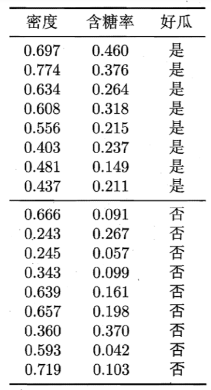
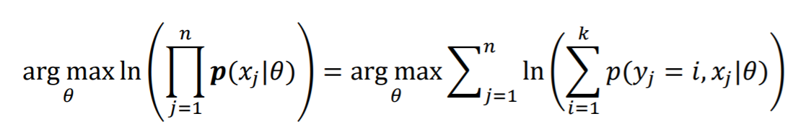
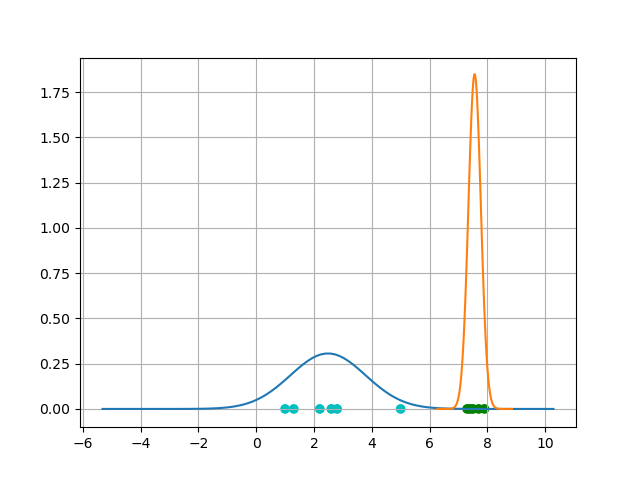
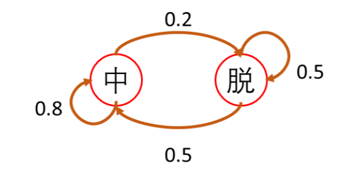

# 第五次作业-贝叶斯网

## 1. 根据一下数据，利用高斯贝叶斯分类器和高斯朴素贝叶斯分类器预测样本x=（密度=0.5， 含糖率=0.3）的类别



### 1.1 高斯贝叶斯分类器

初始化数据

```python
good_melon = np.array([[0.697, 0.774, 0.634, 0.608, 0.556, 0.403, 0.481, 0.437],
                     [0.460, 0.376, 0.264, 0.318, 0.215, 0.237, 0.149, 0.211]])
bad_melon = np.array([[0.666, 0.243, 0.245, 0.343, 0.639, 0.657, 0.360, 0.593, 0.719],
                     [0.091, 0.267, 0.057, 0.099, 0.161, 0.198, 0.370, 0.042, 0.103]])
```


计算好瓜的均值和协方差：

```python
# 均值
good_mean = [0.57375 0.27875]
# 协方差
good_cov =  [[0.01669536 0.01026121]
            [0.01026121 0.01018564]]
```

计算坏瓜的均值和协方差：

```python
# 均值
bad_mean = [0.49611111 0.15422222]
# 协方差
bad_cov =  [[ 0.03791536 -0.00625815]
            [-0.00625815  0.01161969]]
```

通过高斯分布计算概率：

```python
def gaussian(mean, cov, x):
    det = np.linalg.det(cov)
    a = 2 * math.pi * math.sqrt(det)
    tmp = x - mean
    tmp = np.array([tmp])
    b = - np.dot(np.dot(tmp, np.linalg.pinv(cov)), tmp.T) / 2
    pro = math.exp(b) / a
    print(pro)
    return pro
```

好瓜和坏瓜的概率分别是：

```python
good_pro = 8 / 17 * gaussian(good_mean, good_cov, x) = 4.466031268791659 
bad_pro = 9 / 17 * gaussian(bad_mean, bad_cov, x) = 1.5275792661598824
归一化后：pro = [0.74513204 0.25486796]
```

由此可得，使用高斯贝叶斯分类器，样本x=（密度=0.5， 含糖率=0.3）预测为好瓜的概率为0.745，预测为坏瓜的概率为0.255。综上所述，对此样本应该预测为好瓜。

### 1.2 高斯朴素贝叶斯分类器

好瓜的密度和含糖率的的均值和方差为：

```python
good_mean = [0.57375 0.27875]
good_std = [0.12086537 0.09440571
```

坏瓜的密度和含糖率的的均值和方差为：

```python
bad_mean = [0.49611111 0.15422222]
bad_std = [0.18358252 0.10162981]
```

用高斯朴素贝叶斯分类器估计概率：

```python
def naive_gaussian(mean=0, std=1, x=1):
    return math.exp(-math.pow(x - mean, 2) / (2 * math.pow(std, 2))) / (np.sqrt(2 * math.pi) * std)
```

好瓜的概率：

```python
# 密度
good_de = naive_gaussian(good_mean[0], good_std[0], 0.5) = 2.7400544462277714
# 含糖量
good_su = naive_gaussian(good_mean[1], good_std[1], 0.3) =  4.120118571789564
# 好瓜的概率
good_pro = 8 / 17 * good_de * good_su = 5.312634923114169 
```

坏瓜的概率：

```python
# 密度
 bad_de = naive_gaussian(bad_mean[0], bad_std[0], 0.5) = 2.1726075655047907 
# 含糖量
bad_su = naive_gaussian(bad_mean[1], bad_std[1], 0.3) = 1.4031622271725774
# 好瓜的概率
bad_pro = 9 / 17 * bad_de * bad_su =  1.6139228137336026  
```
归一化后：
```python
pro = [0.76699497 0.23300503]
```

由此可得，使用高斯朴素贝叶斯分类器，样本x=（密度=0.5， 含糖率=0.3）预测为好瓜的概率为0.767，预测为坏瓜的概率为0.233。综上所述，对此样本应该预测为好瓜。


## 2. 根据GMM的授课内容，使用EM方法计算参数，在M步更新的公式如下，并给出下列一维数据的上机编程实践。



**数据：**

$$ x_1=1.0,x_2=1.3,x_3=2.2,x_4=2.6,x_5=2.8,x_6=5.0,x_7=7.3,x_8=7.4,x_9=7.5,x_{10}=7.7,x_{11}=7.9 $$

**其中聚类个数k=2, 初始参数 $\mu_1=6, \sigma_1^2=1, P(C1)=0.5,\mu_2=7.5, \sigma_2^2=1, P(C2)=0.5$** 

### 2.1 代码实现

**高斯分布算概率：**

```python
def gaussian(mean=0, std=1, x=1):
    return np.exp(-np.square(x - mean) / (2 * np.square(std))) / (np.sqrt(2 * math.pi) * std)
```

**EM方法：**

```python
X = np.array([1.0, 1.3, 2.2, 2.6, 2.8, 5.0, 7.3, 7.4, 7.5, 7.7, 7.9])
n = 11
mean1 = 6    
mean2 = 7.5    
square_std1 = 1
square_std2 = 1
P_C = np.array([0.5, 0.5])
likelihood0 = 0
likelihood = 1
i = 1
while (np.abs(likelihood - likelihood0) > 0.0001):
    print("================这是第%d次迭代===============" % i)
    likelihood0 = likelihood
    i = i + 1
    # Expectation
    std1 = np.sqrt(square_std1)
    std2 = np.sqrt(square_std2)
    X_C1 = gaussian(mean1, std1, x=X)   # 条件概率 X|C
    X_C2 = gaussian(mean2, std2, x=X)
    P_XC1 = P_C[0] * X_C1   # 联合概率 P(X, C)
    P_XC2 = P_C[1] * X_C2
    P_XC = np.array([P_XC1, P_XC2])
    P_X = np.sum(P_XC, axis=0)
    P_X_tile = np.tile(P_X, (2, 1))
    P_C_X = P_XC / P_X_tile  # 后验概率P(C|X)， 有np.sum(P_C_X, axis=0)=1
    # print(P_C_X)

    # 计算似然函数的值
    sum_K = P_XC1 + P_XC2
    ln_sum_K = np.log(sum_K)
    likelihood = np.sum(ln_sum_K)
    # Maximization
    P_C = np.sum(P_C_X, axis=1) / n
    print("P(Ci):", P_C)
    mean1 = np.sum(np.multiply(X, P_C_X[0])) / np.sum(P_C_X[0])
    mean2 = np.sum(np.multiply(X, P_C_X[1])) / np.sum(P_C_X[1])
    print("均值：", mean1, mean2)
    square_std1 = np.sum(np.multiply(P_C_X[0], np.square(X-mean1))) / np.sum(P_C_X[0])
    square_std2 = np.sum(np.multiply(P_C_X[1], np.square(X-mean2))) / np.sum(P_C_X[1])
    print("方差：", square_std1, square_std2)
```

### 2.2 结果

```markdown
================这是第1次迭代===============
P(Ci): [0.64500433 0.35499567]
均值： 3.2872969953171656 7.52287566272614
方差： 4.888574442710767 0.19934294305174563
================这是第2次迭代===============
P(Ci): [0.57285263 0.42714737]
均值： 2.725105646614704 7.5613836923428055
方差： 2.7732997464887545 0.04632477937295371
================这是第3次迭代===============
P(Ci): [0.54753317 0.45246683]
均值： 2.50242793444456 7.56021562383973
方差： 1.7775274772748577 0.04635580380164239
================这是第4次迭代===============
P(Ci): [0.54558334 0.45441666]
均值： 2.484508246345713 7.560028251793131
方差： 1.693513306711263 0.04639820709485308
================这是第5次迭代===============
P(Ci): [0.54554265 0.45445735]
均值： 2.48413610181452 7.5600205372625116
方差： 1.691779291440376 0.04639883361981646
================这是第6次迭代===============
P(Ci): [0.54554193 0.45445807]
均值： 2.4841294887541365 7.560020393484133
方差： 1.6917485057524604 0.04639884437486865
```

在6次迭代之后，似然函数的增长小于设定的阈值0.0001。此时的实验结果是：

第一类的均值$\mu_1 = 2.48$, 方差$\sigma_1^2=1.69$,$P(C_1)=0.55 $

第二类的均值$\mu_2 = 7.56$, 方差$\sigma_2^2=0.05$,$P(C_2)=0.45 $




## 3. 根据Markov模型授课内容，完成如下习题。

某射击选手，当他射中，则下次也中靶的概率为0.8；当他脱靶，则下次中靶的概率为0.5.若第一次没中，问他第4次射中的概率为多少？



依题意，状态转移矩阵A为（第一行为中靶的转移概率，第二行为脱靶的转移概率）

```python
A = [[0.8, 0.2]
	 [0.5, 0.5]]
```

若第一次脱靶，则初始状态为：

$v_1 = [0, 1]$

第四次的状态

$v_4 = v_3A = (v_2A)A = ((v_1A)A)A$

$v_4 = [0.695, 0.305]$

综上所述，第四次射击射中的概率为0.695。


