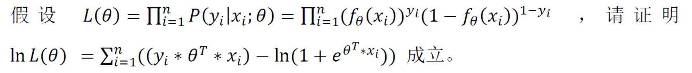
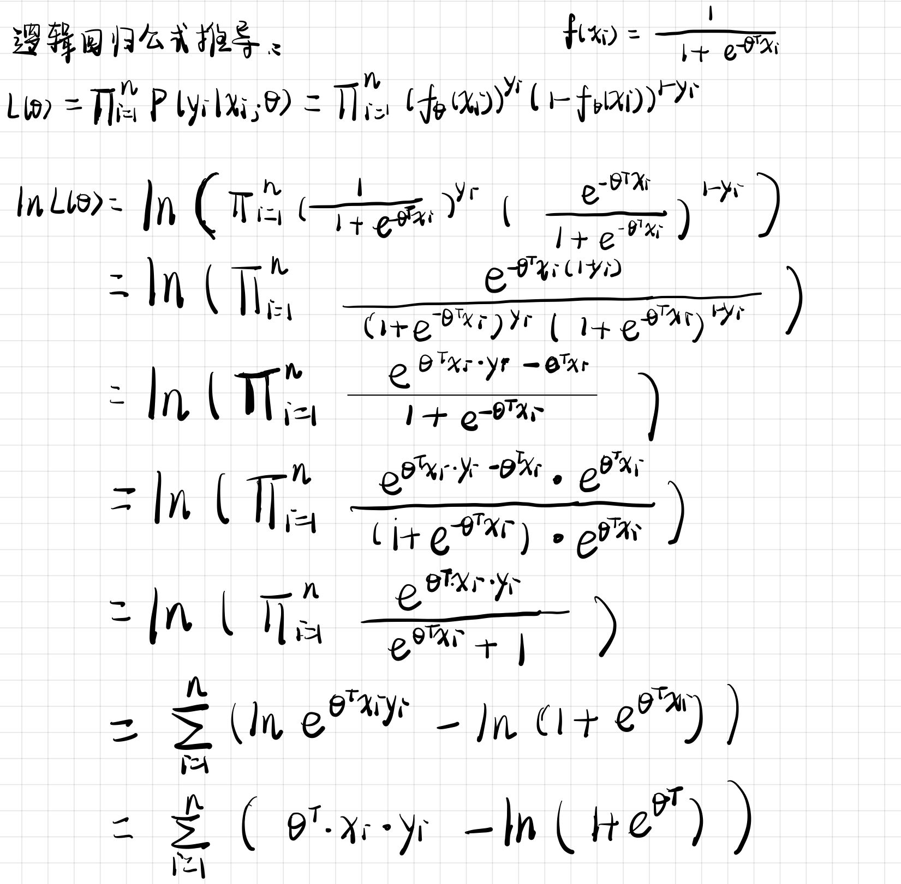
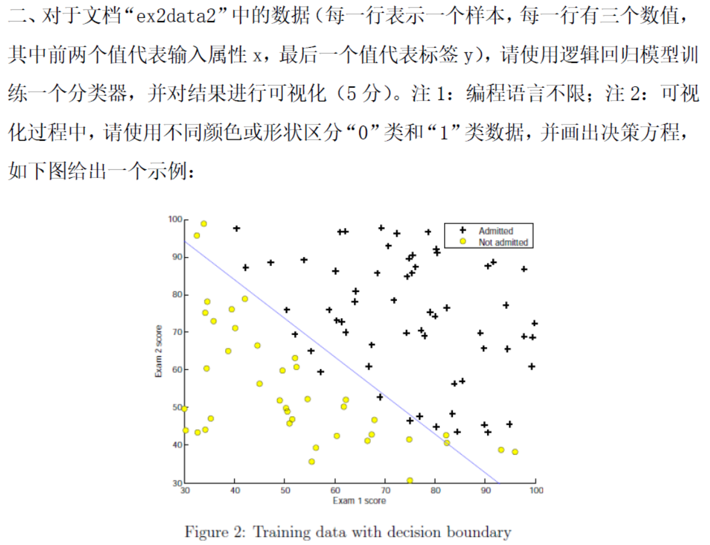
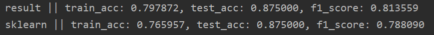
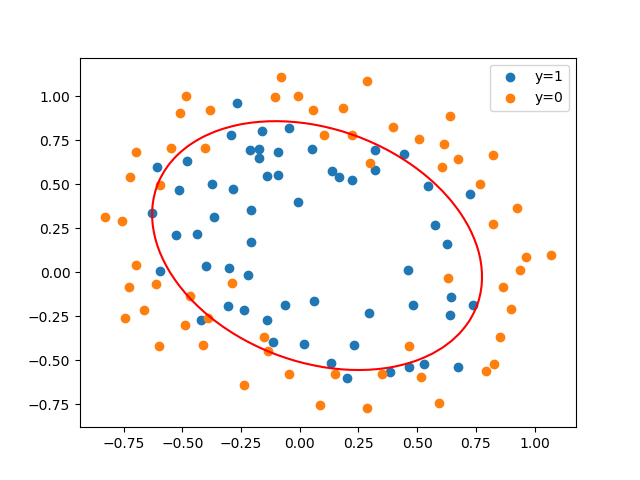

# 逻辑回归作业

## 1. 逻辑回归公式推导



### 推导过程




## 2. 逻辑回归代码实践



### 代码实现

##### 主函数

```python
def main():
    path = "ex2data2.txt"
    data = load_data(path)
    transformed_data = get_tranform_data(data)	# 数据转换
    lr = 0.1	# 初始学习率
    decay = 0.1		# 学习率衰减系数
    epoch = 1000
    x, y = split_data_x_y(transformed_data)		# 标签和数据分开
    train_x, test_x, train_y, test_y = train_test_split(x, y, test_size=0.2)
    weights = gradAscent(train_x, test_x, train_y, test_y, lr, decay, epoch)	# 梯度上升
    sklearn_result(train_x, test_x, train_y, test_y)	# 对比scikit-learn库结果	
    plot_decision_border(data, weights)
```

##### 数据转换

```python
def get_tranform_data(data):
    # x1, x2 ——>  c, x1, x2, x1*x2, x1^2, x2^2
    constant = np.ones((data.shape[0]))
    x1_x2 = data[:, 0] * data[:, 1]
    square_x1 = data[:, 0] * data[:, 0]
    square_x2 = data[:, 1] * data[:, 1]
    transformed_data = np.insert(data, 0, values=constant, axis=1)
    transformed_data = np.insert(transformed_data, 3, values=square_x2, axis=1)
    transformed_data = np.insert(transformed_data, 3, values=square_x1, axis=1)
    transformed_data = np.insert(transformed_data, 3, values=x1_x2, axis=1)
    return transformed_data
```

##### 梯度上升

```python
def gradAscent(train_x, test_x, train_y, test_y, lr, decay, epoch):
    m, n = train_x.shape  # m：样本个数，n：属性个数
    weights = np.ones((n, 1))  # 这是要求的参数，初始化
    train_acc_list = []
    test_acc_list = []
    f1_list = []
    for i in range(0, epoch):
        fx = sigmoid(np.matmul(train_x, weights))  # 预测值
        error = train_y - fx      # m*1的
        grad = np.matmul(train_x.T, error)   # n*m 和 m*1  得到 n*1
        lr_i = lr * 1.0 / (1.0 + decay * i)     # 学习率衰减
        weights = weights + lr_i * grad       # 梯度更新
        # 训练集
        pred_label = get_pred_label(fx)     # 预测的标签
        train_acc = accuracy_score(train_y, pred_label)
        train_acc_list.append(train_acc)
        # 测试集
        test_fx = sigmoid(np.matmul(test_x, weights))
        test_pred_label = get_pred_label(test_fx)  # 预测的标签
        test_acc = accuracy_score(test_y, test_pred_label)
        test_acc_list.append(test_acc)
        # print(weights.T)
        f1 = f1_score(np.append(train_y, test_y, axis=0), np.append(pred_label, test_pred_label, axis=0), average="weighted")
        f1_list.append(f1_score)
        print("result || train_acc: %f, test_acc: %f, f1_score: %f" % (train_acc, test_acc, f1))
    return weights
```

##### scikit-learn库结果	

```python
def sklearn_result(train_x, test_x, train_y, test_y):
    classifier = LogisticRegression()
    classifier.fit(train_x, train_y.ravel())
    train_pred = classifier.predict(train_x)
    train_acc = accuracy_score(train_y, train_pred)
    test_pred = classifier.predict(test_x)
    test_acc = accuracy_score(test_y, test_pred)
    f1 = f1_score(np.append(train_y, test_y, axis=0), np.append(train_pred, test_pred, axis=0), average="weighted")
    print("sklearn || train_acc: %f, test_acc: %f, f1_score: %f" % (train_acc, test_acc, f1))

```

### 实验结果

##### 实验结果



##### 决策边界

