# 第六次作业-降维

## 1. 根据授课内容，证明使用迭代的EM算法求解PCA参数时，参数在M步更新的公式为：

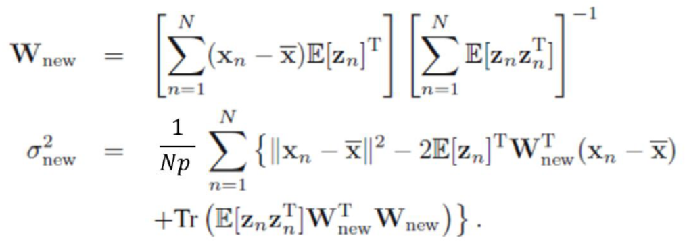

### 推导过程：

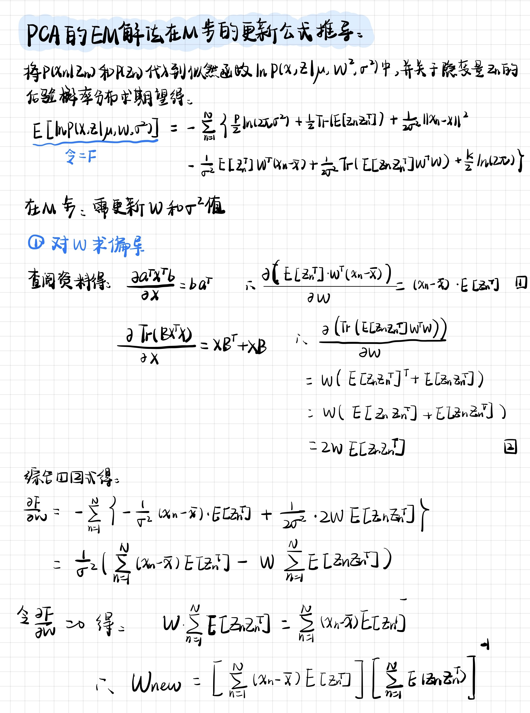

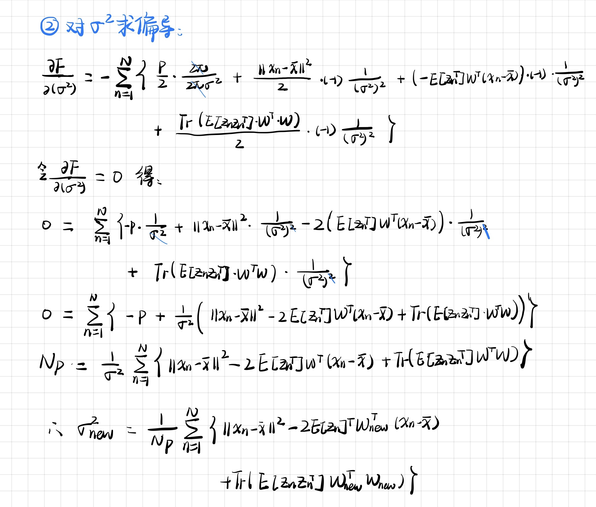


## 2. 使用 orl_faces 数据集，对 PCA 算法进行上机实践 ：

（a）利用 SVD 分解计算人脸图像的低维表示 （8维）；

（ b）使用最大似然估计算人脸图像的低维表示；

（ c）使用简化的 EM 算法（ 𝜎2→0）计算人脸图像的低维表示。

### 2.1 SVD分解计算人脸低维表示

```python
def SVD_PCA(X, k):
    XT = np.transpose(X)  # X的转秩
    XT_X = np.dot(XT, X)  # XT * X
    # SVD 得特征值和特征向量
    start = time.time()
    eigenvalue, feature_vector = np.linalg.eig(XT_X)
    end = time.time()
    print("SVD方法中400*400矩阵XT_X计算特征值和特征向量的时间为：%f秒" % (end-start))
    idx = np.argsort(-eigenvalue)  # 从小到大排序,返回索引, 加个负号就是从大到小
    eigenvalue = eigenvalue[idx]
    feature_vector = feature_vector[:, idx]
    # 取前k个
    LAMBDA = eigenvalue[0:k]
    V = feature_vector[:, 0:k]
    U = np.dot(X, V) / np.sqrt(LAMBDA)
    return U


def get_Z_SVD(U, X, X_mean, k, j):
    img = X[:, j]
    Z = np.dot(np.transpose(U), X[:, j])
    print("SVD Z:\n", Z)
    Z = Z.reshape((k, 1))
    image = (np.dot(U, Z) + X_mean).reshape(112, 92)
    str1 = "../IMG/SVD" + str(j + 1) + "_k_" + str(8) + ".png"
    plt.imshow(image, plt.cm.gray)
    plt.savefig(str1)
    return Z
```


### 2.2 最大似然估计算人脸图像的低维表示

```python
def ML_PCA(X, k, p):
    S = np.cov(X, bias=True)  # bias = True表示有偏估计,分母N，无偏估计N-1
    start = time.time()
    eigenvalue, feature_vector = np.linalg.eig(S)
    end = time.time()
    print("ML方法中10304*10304矩阵S计算特征值和特征向量的时间为：%f秒" % (end - start))
    # np.linalg.eig以复数的形式运算，算法在收敛时，虚部可能还没有完全收敛到0，
    # 但是都已经很小了，计算的时候可以直接取实部
    eigenvalue = np.real(eigenvalue)
    feature_vector = np.real(feature_vector)
    idx = np.argsort(-eigenvalue)  # 排序,返回索引
    eigenvalue = eigenvalue[idx]
    feature_vector = feature_vector[:, idx]
    U_k = feature_vector[:, 0:k]  # S的前k个最大特征值对应的特征向量
    A_k = np.diag(eigenvalue[0:k])
    SEGMA2 = np.sum(eigenvalue[k:p]) / (p - k)
    W = np.dot(U_k, np.sqrt(A_k - SEGMA2 * np.eye(k)))
    return W, SEGMA2


def get_Z_ML(W, SEGMA2, X, X_mean, k, j):
    img = X[:, j]
    C = np.dot(np.transpose(W), W) + SEGMA2 * np.eye(k)
    C_1 = np.linalg.inv(C)
    Z = np.dot(np.dot(C_1, np.transpose(W)), img)
    print("ML Z:\n", Z)
    Z = Z.reshape((k, 1))
    image = (np.dot(W, Z) + X_mean).reshape(112, 92)
    str1 = "../IMG/ML" + str(j + 1) + "_k_" + str(8) + ".png"     # k=8重构图像X保存
    plt.imshow(image, plt.cm.gray)
    plt.savefig(str1)
    return Z

```


### 2.3 简化的EM算法计算人脸图像的低维表示

**EM算法迭代过程中假设前后两次的低维表示Z足够相似，算法就已经收敛。**

```python
def EM_PCA(X, p, k):
    W = np.random.rand(p, k)  # 正态分布初始化W
    Z0 = np.zeros((k, n))
    for i in range(0, 1000):
        # E步
        WT = np.transpose(W)
        WT_W = np.dot(WT, W)
        WT_W_1 = np.linalg.inv(WT_W)
        Z = np.dot(np.dot(WT_W_1, WT), X)
        # M步
        ZT = np.transpose(Z)
        Z_ZT = np.dot(Z, ZT)
        Z_ZT_1 = np.linalg.inv(Z_ZT)
        W = np.dot(np.dot(X, ZT), Z_ZT_1)
        if (np.allclose(Z0, Z)):    # 两个矩阵足够相似就当作已经收敛
            print("EM算法在第%d次收敛" % (i+1))
            break
        else:
            Z0 = Z
    return W, Z


def get_Image_EM(W, Z, X_mean, k, j):
    print("EM Z:\n", Z[:, j])
    Z = Z[:, j].reshape((k, 1))
    image = (np.dot(W, Z) + X_mean).reshape(112, 92)
    str1 = "../IMG/EM.png"
    plt.imshow(image, plt.cm.gray)
    plt.savefig(str1)

```


## 2.4 实验结果

- 实验中在40个文件夹中随机选择，计算W；

- 在选出的文件夹的10张图像中随机选择1张进行重构


### 2.4.1

**实验结果：**

从实验结果可以看出维数太大的协方差矩阵计算特征值和特征向量的时间很慢，在实际使用中应当尽量避免这种计算，使用SVD（当样本维度大于样本个数时）或简化的EM算法代替，EM算法迭代收敛的次数很快（实验中一般在100次以内收敛）。低维表示Z的结果如下：

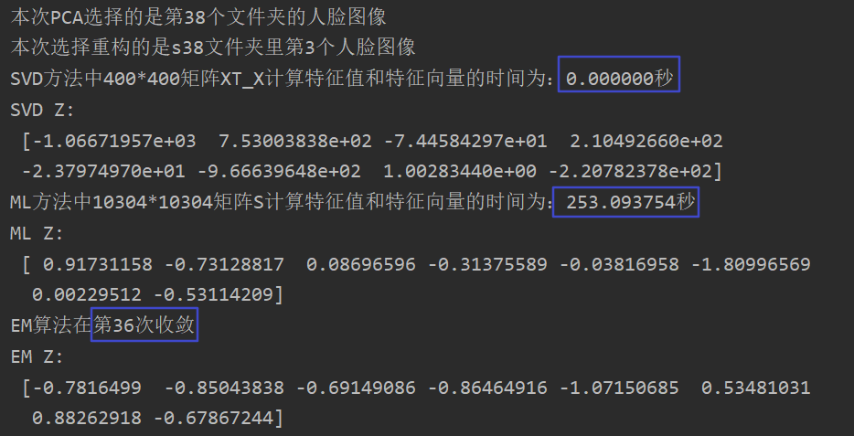


**重构图像：(从左至右依次为原图，SVD重构的图像, 最大似然重构的图像，EM算法重构的图像）**

<center class="half">    
 	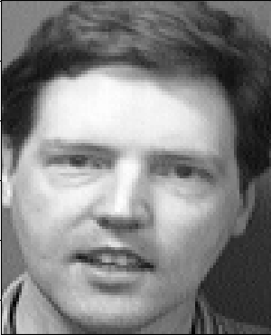
    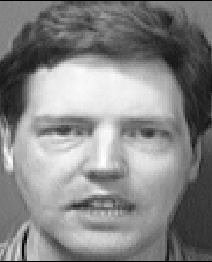 
    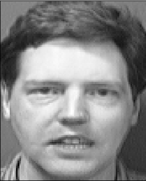
    
</center>

从上面图像可以看出三种方法重构出的图像基本相似，在使用中可以优先使用速度较快的SVD（当样本维度大于样本个数时）和EM方法。

### 2.4.2

**实验结果：**

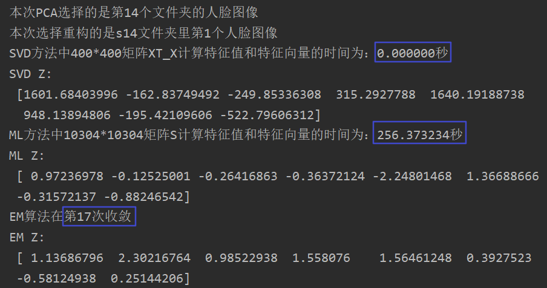


**重构图像：(从左至右依次为原图，SVD重构的图像, 最大似然重构的图像，EM算法重构的图像）**

<center class="half">    
 	
    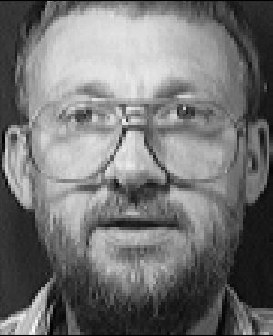 
    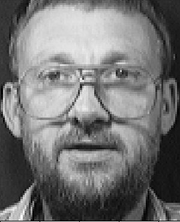
    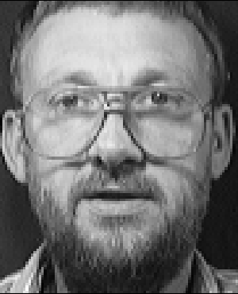
</center>


### 2.4.3

**实验结果：**

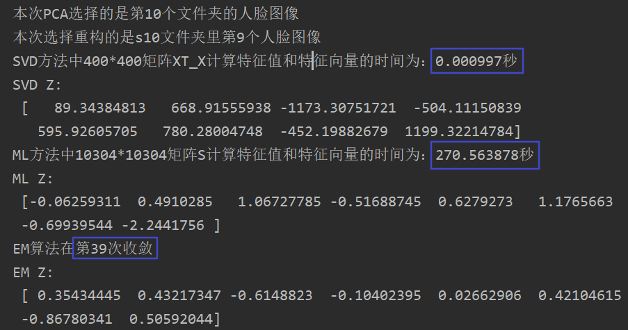


重构图像：(从左至右依次为原图，SVD重构的图像, 最大似然重构的图像，EM算法重构的图像）**

<center class="half">    
 	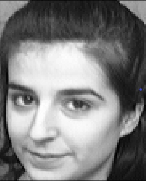
    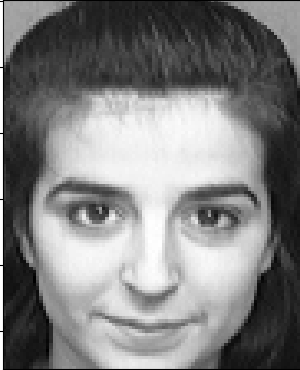 
    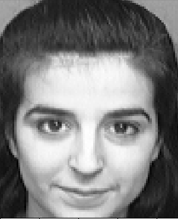
    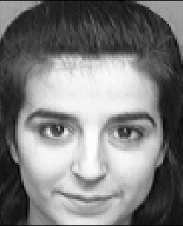
</center>


