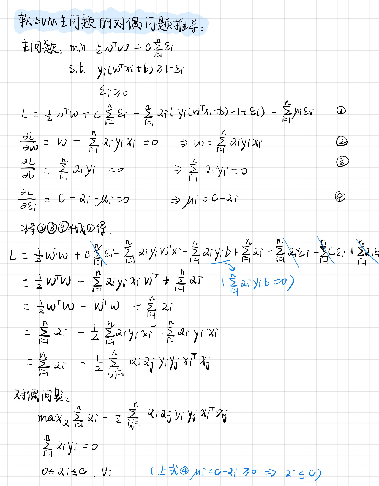
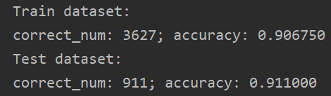
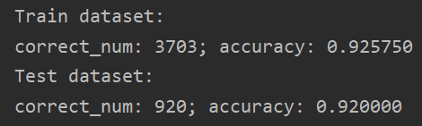
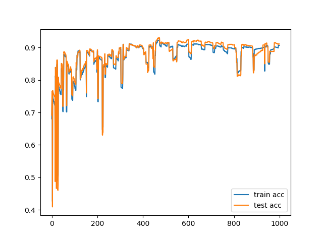
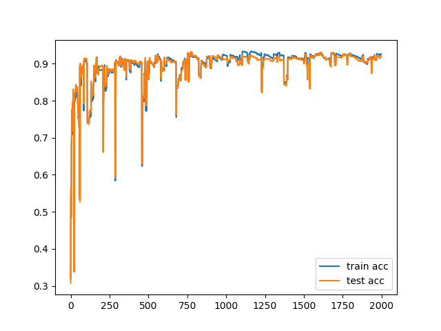
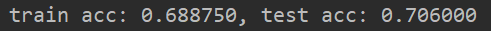
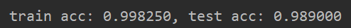
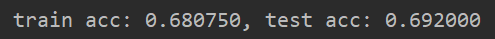
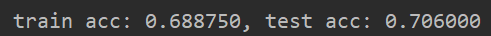

# SVM作业

### 1. 根据授课内容，推导软间隔SVM主问题的对偶问题



### 2. 根据软间隔SVM的高效求解算法佩加索斯（Pegasos）算法训练一个分类器，判断数据中的样本是否是垃圾邮件，计算预测精度，其中C设为0.1

#### 2.1 代码实现

**数据集加载**

```python
def load_data(data_type):
    '''
    加载数据集, 训练集数据(4000, 1899)，测试集(1000, 1899)
    数据类型从int8改成int32, 为了将标签从0改成-1
    :param data_type:
    :return:
    '''
    train_path = '../data/spamTrain.mat'
    test_path = '../data/spamTest.mat'
    if data_type == 'train':
        train_data = scio.loadmat(train_path)
        # 因为读取的数据为int8, 0-1会溢出变成255，所以转成int32
        data = np.array(train_data['X'], dtype='int32')
        label = np.array(train_data['y'], dtype='int32')
        # 把标签中的0变成-1，1还是不变，只是为了与授课内容保持一致
        new_label = 2 * label - 1
    elif data_type == 'test':
        test_data = scio.loadmat(test_path)
        data = np.array(test_data['Xtest'], dtype='int32')
        label = np.array(test_data['ytest'], dtype='int32')
        new_label = 2 * label - 1
    return data, new_label
```

**佩加索斯算法实现**
```python
def pegasos(data, label, C=0.1, iter_times=50):
    # weights = np.random.rand(n, 1)
    # bias = random.random()
    weights = np.zeros((n, 1))
    bias = 0
    my_lambda = 1 / (C * m)
    print(my_lambda)
    train_acc_list = []
    test_acc_list = []
    for j in range(1, iter_times+1):
        eta = 1 / (my_lambda * j)   # 学习率
        i = random.randint(0, m-1)
        print("第%d次选择的是第%d个" % (j, i))
        yi = label[i]
        xi = data[i, :]
        temp = yi * (np.dot(xi, weights) + bias)
        print(temp)
        if temp < 1:
            weights = weights - eta * (my_lambda * weights - yi * xi.reshape(n, 1))
            bias = bias - eta * (-yi)
        else:
            weights = weights - eta * my_lambda * weights
            bias = bias - eta * 0
        print(bias)
        print("Train dataset:")
        train_acc = get_acc(weights, bias, data, label)
        train_acc_list.append(train_acc)
        test_data, test_label = load_data('test')
        print("Test dataset:")
        test_acc = get_acc(weights, bias, test_data, test_label)
        test_acc_list.append(test_acc)
    return train_acc_list, test_acc_list
```

**主函数**

```python
def main():
    data, label = load_data('train')
    m, n = data.shape
    train_acc, test_acc = pegasos(data, label, iter_times=1000)
    plot_acc(train_acc, test_acc)
```

**sickit-learn库的SVM函数调用**

```python
def sklearn_svm():
    from sklearn import svm
    # clf = svm.SVC(C=0.1, kernel='linear')
    clf = svm.SVC(C=0.1)
    data, label = load_data('train')
    test_data, test_label = load_data('test')
    clf.fit(data, label.ravel())
    print(clf.support_vectors_)
    acc = clf.score(data, label)
    test_acc = clf.score(test_data, test_label)
    print("train acc: %f, test acc: %f" % (acc, test_acc))
```

#### 2.2 实验结果

##### 2.2.1 自己实现的软SVM

**参数设置如下：**

```markdown
正则化常数：C = 0.1
初始化：w和b都初始化为0
迭代次数：iter_time=1000或者2000
```

**对垃圾邮件的分类结果**

当迭代次数分别为1000或者2000时的分类结果：

<center class="half">         </center>
准确率变化：

<center class="half">      </center>
##### 2.2.2 sickit-learn库的SVM函数

左图未使用核函数，右图使用线性核函数

$$ 𝐾(𝑥_𝑖,𝑥_𝑗)={𝑥_𝑖}^𝑇𝑥_𝑗$$

<center class="half">         </center>
左图使用高斯核函数，右图使用多项式核函数

$ 𝐾(𝑥_𝑖,𝑥_𝑗)=（1+{𝑥_𝑖}^𝑇𝑥_𝑗)^𝑑 $

$𝐾(𝑥_𝑖,𝑥_𝑗)= e^{−||𝑥_𝑖−𝑥_𝑗||^2/2𝜎^2}$

<center class="half">         </center>
在本题数据集的情况下，用线性核函数更为合适


