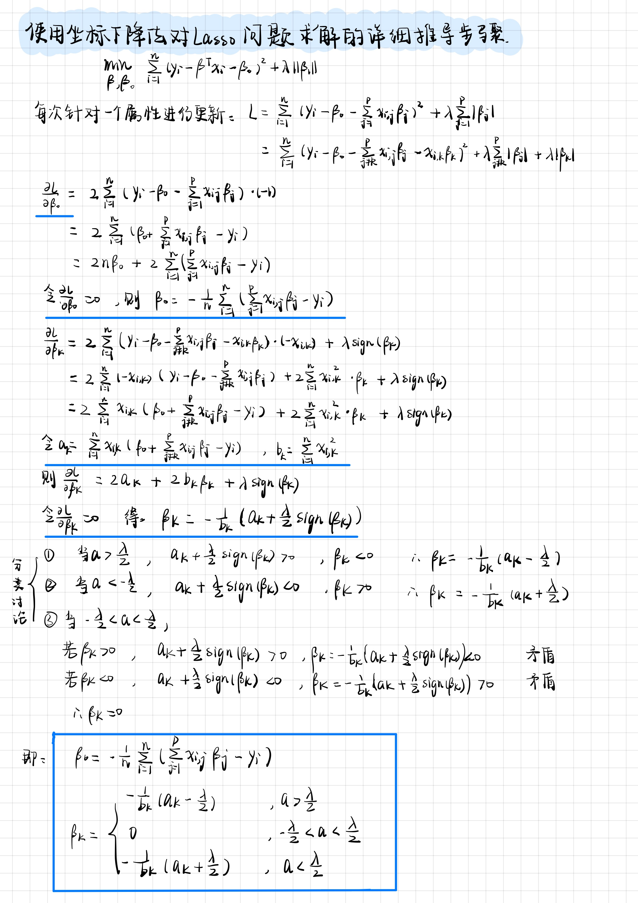
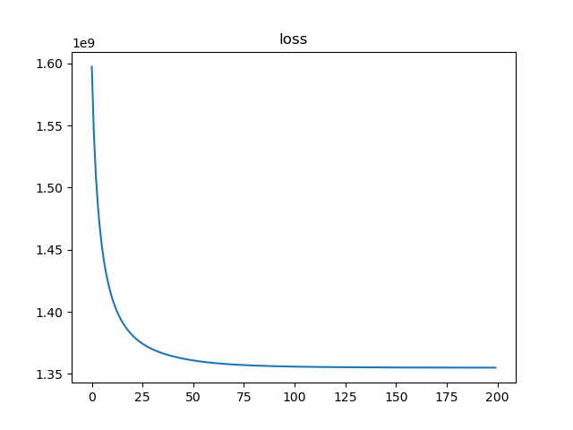
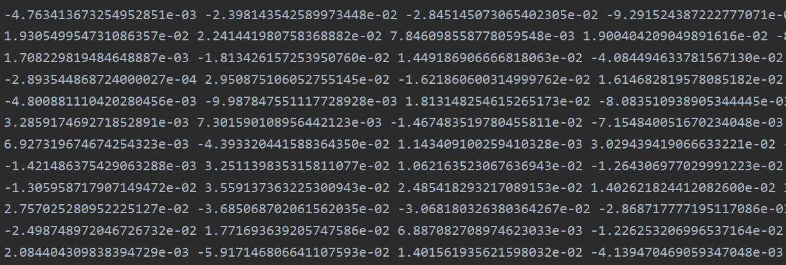

# Lasso回归与稀疏表示

## 1. 使用坐标下降法求解Lasso问题的详细推导步骤




## 2. 编程实践，学习人脸的稀疏表示

### 2.1 代码实现

**读取人脸数据，并初始化字典B：**

```python
def get_original_x(path, p, n, k):
    b_col = 0
    X = np.zeros((p, n))
    B = np.zeros((p, k))
    dir_list = os.listdir(path)
    for i in range(0, len(dir_list)):
        dir_path = path + dir_list[i]
        file_list = os.listdir(dir_path)
        random_file_num = random.randint(0, len(file_list) - 1)
        for j in range(0, len(file_list)):
            file_path = dir_path + '/' + file_list[j]
            image = read_pgm(file_path, byteorder='<')
            x_col = 10 * i + j
            X[:, x_col] = image
            if (j == random_file_num):
                B[:, b_col] = image
                b_col = b_col + 1
    return X, B
```

**损失函数计算：**

```python
def loss_function(X, B, A, lamda):
    BA = np.dot(B, A)
    X_BA = X - BA
    loss = np.sum(np.square(X_BA))
    loss = loss + lamda * np.sum(A)
    return loss
```

**交替优化：**

```python
p = 10304
n = 400
k = 40
my_lambda = 1
Alpha = np.zeros((k, n))
Alpha = np.mat(Alpha)
loss_list = []
path = "../orl_faces/"
X, B = get_original_x(path, p, n, k)
lam = my_lambda / 2
for i in range(0, 1000):
    # 固定B，优化Alpha
    for j in range(0, n):
        alpha = Alpha[:, j]
        x = X[:, j]
        for m in range(0, k):
            alpha_m = float(alpha[m])
            B_m = B[:, m].reshape(1, -1)
            a_m = np.dot(x + np.dot(B[:, m], alpha_m).reshape(x.shape) - np.dot(B, alpha).reshape(x.shape), - B[:, m])
            b_m = np.dot(B_m, B[:, m])
            if (a_m > lam):
                alpha[m] = - (a_m - lam) / b_m
            elif (a_m < - lam):
                alpha[m] = - (a_m + lam) / b_m
            else:
                alpha[m] = 0.0

    # 固定Alpha，优化B
    AlphaT = Alpha.I
    AA_T = np.dot(Alpha, AlphaT)
    det = np.linalg.det(AA_T)	# 计算行列式
    if(det == 0):
        # 不可逆
        I = np.identity(k)
        AA_T_I_T = AA_T + my_lambda * I
        B = np.dot(np.dot(X, AlphaT), AA_T_I_T.I)
     else:
        # 可逆
        B = np.dot(np.dot(X, AlphaT), AA_T.I)
```

### 2.2 实验结果

实验中$k=40$, $\lambda=1$, $Alpha$初始化为0

由于稀疏表示的优化过程速度较慢，在每次迭代过程中，对稀疏表示Alpha和字典B进行10次优化，以此减少循环次数，加快优化过程。

迭代次数$iter\_time = 200$

优化过程的loss曲线如图：



最后的稀疏表示Alpha示例如下：



最后稀疏标志矩阵中的值都相对较小接近0，loss的下降曲线证明了算法的有效性，但是需要更多的迭代时间达到更好的稀疏效果。

