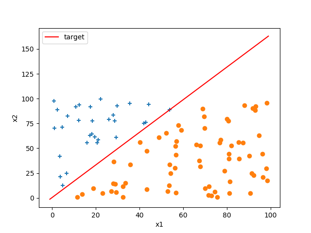

# Project1

## 1. 实验内容

创建一个线性可分的数据集D和一个目标函数f，通过实验理解感知机学习算法训练过程。

（1）创建数据量为20的数据集，设置学习率$\eta$为1。观察感知机的收敛过程。将数据样本和目标函数以及感知机最后得到的逼近结果画出。

（2）换另一个随机生成的数据量为20的数据集，重复实验（1），比较两次的结果。

（3）将实验（1）中数据集的数据量换成100和1000，比较两次的结果。

（4）将学习率$\eta$换成0.01和0.0001，重复上述（1）（2）（3）


## 2. 实验原理

### 感知机学习原理

感知机是二分类的线性分类模型，旨在得到一个可以将输入空间中的正实例和负实例正确分类的的超平面。

感知机初始化为：(2维)

$$w0 + w1* x1 + w2* x2 = 0$$

对于数据集里某样本x，目标值为t（target)，感知机输出为o(output)

感知机的对目标函数的逼近过程中参数值变化：

$$w0 <-- w0 + \eta * (t-o)$$

$$w1 <-- w1 + \eta * (t-o)* x1$$

$$w2 <-- w2 + \eta *(t-o)* x2$$

若输出值和目标值相同，参数不变；若输出值和目标值不相同，说明误分类的样本，参数更新。

直至算法收敛。

### 代码实现

```python
lr = 1                          # 学习率
points = get_points()           # 数据集
print("points:", points)
tar_w_list = get_target()       # 目标函数
print("target function: %f + %f*x1 + %f*x2" % (tar_w_list[0], tar_w_list[1], tar_w_list[2]))
# 得到样本集的标签 [1, -1]
labels = []
points_list1 = []
points_list2 = []
for i in range(0, points.shape[0]):
    t = get_label(points[i, :], tar_w_list)
    labels.append(t)
    if(t == 1):
        points_list1.append(points[i, :])
    else:
        points_list2.append(points[i, :])
points_list1 = np.array(points_list1)
points_list2 = np.array(points_list2)
print(labels)
print(points_list1.shape)
# 画出数据集和目标函数
plt_point_target(points_list1, points_list2, tar_w_list)
# 感知机初始化
w_list = []
w0 = random.random() * 10
w1 = random.random() * 10
w2 = random.random() * (-10)
w_list.append(w0)
w_list.append(w1)
w_list.append(w2)

# 感知机开始迭代，误分类驱动，反向传播
iter = True
iter_num = 0
while(iter):
    print('_____________________________')
    out_list = []
    for j in range(0, points.shape[0]):
        t = labels[j]
        o = get_label(points[j, :], w_list)
        out_list.append(o)
        # 参数更新过程
        w_list[0] = w_list[0] + lr * (t - o)
        w_list[1] = w_list[1] + lr * (t - o) * points[j, 0]
        w_list[2] = w_list[2] + lr * (t - o) * points[j, 1]
    print(labels)
    print(out_list)
    iter_num = iter_num + 1
    # 若迭代超过1000次还未正确分类，说明学习率过大，参数无法更新到合适的值
    if(iter_num > 1000):
        plt_tar_hypo(points_list1, points_list2, tar_w_list, w_list)
        break
    # 全分类正确，感知机学习结束
    if(labels == out_list):
        print(points)
        print("iter_num:", iter_num)
        plt_tar_hypo(points_list1, points_list2, tar_w_list, w_list)
        print("target function: %f + %f*x1 + %f*x2" % (tar_w_list[0], tar_w_list[1], tar_w_list[2]))
        print("hypothesis: %f + %f*x1 + %f*x2" % (w_list[0], w_list[1], w_list[2]))
        iter = False
```


## 3. 实验结果

### 3.1 实验1

dataset size = 20     $\eta = 1 $
```markdown
[[28.61646949 70.88814577]
 [73.50781015 64.01316606]
 [46.0189922   4.58367774]
 [16.36215559 10.19159391]
 [48.61497509 89.61968865]
 [90.39404072 61.83761039]
 [78.49710372 90.24901797]
 [66.09758696 97.49989229]
 [39.87428791  9.55327819]
 [74.43473651 23.93834799]
 [53.02551824 22.30222286]
 [38.45584436 19.84366671]
 [42.66923353 22.22909771]
 [57.12355684 77.2364384 ]
 [77.44987977 63.11445966]
 [ 5.57984549 77.78968332]
 [55.13021524 42.36765199]
 [67.45287009 40.14873804]
 [65.46905922 33.47080231]
 [28.12489655 61.02777267]]
```

感知机学习算法迭代次数 $ iter\_num: 12$

目标函数：$ target\quad function: 1.549994 + 6.981865*x1 + (-3.988348)*x2 $ 

感知机结果：$ hypothesis: 13.294257 + (-640.479480)*x1 + (416.161120)*x2$

<center class="half">         </center>
### 3.2 实验2(重复实验1)

dataset size = 20     $\eta = 1 $

```markdown
[[63.82937956 47.2903587 ]
 [51.6842955  68.32936008]
 [36.2813762  85.73140469]
 [72.58808632 94.14371653]
 [20.6758409  91.64946994]
 [14.12400394 33.98013894]
 [81.53773101 65.61288082]
 [47.04210482  3.03193386]
 [36.41936935 11.01770041]
 [64.93863278 60.24739338]
 [49.65161832 13.10760933]
 [46.44501397 29.78806538]
 [27.55372621 51.49671781]
 [79.98475996 83.67879113]
 [94.01363409 18.14893125]
 [19.13005928 48.73554788]
 [ 2.11820976 69.86331908]
 [77.08048693 42.8118102 ]
 [57.55193481 20.3761364 ]
 [27.64788764 42.64834344]]
```

感知机学习算法迭代次数 $ iter\_num: 4$

目标函数：$ target\quad function: 4.811540 + 2.115774*x1 + (-2.756696)*x2 $ 

感知机结果：$ hypothesis: -0.912965 + (-241.023497)*x1 + 309.058605*x2$

<center class="half">         </center>
### 3.3 实验3(更改数据集)

#### 3.3.1 dataset size = 100    

$\eta = 1 $  (数据集省略)

iter_num: 8
target function: 0.160752 + 9.020976*x1 + -9.089589*x2
hypothesis: 15.499031 + -557.305241*x1 + 565.517874*x2


感知机学习算法迭代次数 $ iter\_num: 8$

目标函数：$ target\quad function: 0.160752 + 9.020976*x1 + (-9.089589)*x2 $ 

感知机结果：$ hypothesis: 15.499031 + (-557.305241)*x1 + 565.517874*x2$

<center class="half">         </center>
#### 3.3.2 dataset size = 1000

$\eta = 1 $  (数据集省略)

由于数据量增大，将数据集样本的x的取值范围从之前的100改为1000

感知机学习算法迭代次数 $ iter\_num: 9$

目标函数：$ target\quad function: 0.696982 + 9.943499*x1 + (-9.149497)*x2 $ 

感知机结果：$ hypothesis: 19.770125 + (-10345.562801)*x1 + 9515.332652*x2$

<center class="half">         </center>
上述实验结果仅在极少数的情况下出现。更多次实验结果示例如下：（迭代1000次）
感知机迭代1000次仍然不能收敛，对大部分样本不能正确分类。


### 3.4  实验4(更改学习率重复实验1,2,3)

#### 3.4.1  $\eta=0.01$

##### 3.4.1.1 dataset size=20

感知机学习算法迭代次数 $ iter\_num: 4$

目标函数：$ target\quad function: 2.958599 + 7.166583*x1 + (-9.149258)*x2 $ 

感知机结果：$ hypothesis: 5.113114 + (-2.047190)*x1 + 2.217182*x2$

<center class="half">         </center>
##### 3.4.1.2 重复dataset size=20

感知机学习算法迭代次数 $ iter\_num: 3$

目标函数：$ target\quad function: 7.412088 + 4.621192*x1 + (-2.289750)*x2 $ 

感知机结果：$ hypothesis: 6.508403 + (-0.583734)*x1 + 0.120774*x2$

<center class="half">         </center>
##### 3.4.1.3 dataset size=100

感知机学习算法迭代次数 $ iter\_num: 3$

目标函数：$ target\quad function: 2.025009 + 9.242457*x1 + (-5.627253)*x2 $ 

感知机结果：$ hypothesis: 4.367555 + (-3.189230)*x1 + 2.189693*x2$

<center class="half">         </center>
##### 3.4.1.4 dataset size=1000

感知机学习算法迭代次数 $ iter\_num: 8$

目标函数：$ target\quad function: 0.946367 + 3.534673*x1 + (-8.029296)*x2 $ 

感知机结果：$ hypothesis: 9.677941 + (-63.465379)*x1 + 144.331975*x2$

<center class="half">         </center>
#### 3.4.2 $\eta=0.0001$

##### 3.4.2.1 dataset size=20

感知机学习算法迭代次数 $ iter\_num: 1$

目标函数：$ target\quad function: 2.332060 + 0.848228*x1 + (-1.120675)*x2 $ 

感知机结果：$ hypothesis: 6.521673 + 8.545962*x1 + (-9.801904)*x2$

<center class="half">         </center>
##### 3.4.2.2 重复dataset size=20

感知机学习算法迭代次数 $ iter\_num: 288$

目标函数：$ target\quad function: 9.623035 + 4.659450*x1 + (-8.053595)*x2 $ 

感知机结果：$ hypothesis: 1.333701 + (-0.057348)*x1 + 0.045406*x2$

<center class="half">         </center>
##### 3.4.2.3 dataset size=100

感知机学习算法迭代次数 $ iter\_num: 910$

目标函数：$ target\quad function: 8.823345 + 3.728547*x1 + (-6.852522)*x2 $ 

感知机结果：$ hypothesis: 3.459938 + (-0.560713)*x1 + 0.871014*x2$

<center class="half">         </center>
##### 3.4.2.4 dataset size=1000

感知机学习算法迭代次数 $ iter\_num: 24$

目标函数：$ target\quad function: 0.498553 + 3.384552*x1 + (-7.733942)*x2 $ 

感知机结果：$ hypothesis: 9.899966 + (-0.833419)*x1 + 1.880885*x2$

<center class="half">         </center>


## 4. 结果分析

1. 感知机的初始化对迭代次数会有重要影响，若初始化值离目标值较为接近，分类错误的实例少，在合适的学习率的情况下经过少数几次迭代即可收敛。（例如：**实验3.4.2.1**） 
2. 感知机学习过程需要适当的学习率。学习率过大，每次参数的更新跨度大，容易震荡不收敛。此情况在数据集较大时发生概率大（因为使用的是Batch gradient descent），造成感知机最后不能学习到一个正确分类的函数（例如：**实验3.3.2**）。
3. 在梯度下降算法中，数据集较大时适当选用随机梯度下降（stochastic gradient descent）或mini-batch gradient descent。

## 附录

其他功能函数

```python
import random
import numpy as np
import matplotlib.pyplot as plt

## 生成数据集
def get_points():
    point_list = []
    for i in range(0, 20):
        x1 = random.random() * 100
        x2 = random.random() * 100
        point_list.append([x1, x2])
    point_list = np.array(point_list)
    return point_list

# 目标函数
def get_target():
    w_list = []
    w0 = random.random() * 10
    w1 = random.random() * 10
    w2 = random.random() * (-10)
    w_list.append(w0)
    w_list.append(w1)
    w_list.append(w2)
    return w_list

# 画目标函数
def plt_point_target(point_list1, point_list2, tar_w_list):
    x = np.arange(-1, 100, 1)
    y = -(tar_w_list[0] + tar_w_list[1]*x)/tar_w_list[2]
    plt.plot(x, y, "red")
    plt.legend(["target"], loc=0)
    plt.scatter(point_list1[:, 0], point_list1[:, 1], marker='+')
    plt.scatter(point_list2[:, 0], point_list2[:, 1])
    plt.xlabel("x1")
    plt.ylabel("x2")
    plt.savefig("points_target.png")
    plt.show()

# 画感知机结果
def plt_tar_hypo(point_list1, point_list2, tar_w_list, w_list):
    x = np.arange(-1, 100, 1)
    y1 = -(tar_w_list[0] + tar_w_list[1] * x) / tar_w_list[2]
    y2 = -(w_list[0] + w_list[1]*x)/w_list[2]
    plt.plot(x, y1, "red")
    plt.plot(x, y2, "green")
    plt.legend(["target", "hypothesis"], loc=0)
    plt.scatter(point_list1[:, 0], point_list1[:, 1], marker="+")
    plt.scatter(point_list2[:, 0], point_list2[:, 1])
    plt.xlabel("x1")
    plt.ylabel("x2")
    plt.savefig("points_target_hypothesis.png")
    # plt.show()

# 打标签
def get_label(p, w_list):
    label = -1
    y = -(w_list[0] + w_list[1] * p[0]) / w_list[2]
    if(p[1] > y):
        label = 1
    else:
        label = -1
    return label
```

