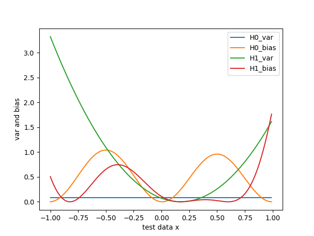

## project2-泛化误差的偏差方差分解

### 1. 实验内容

（1）理解泛化误差的组成

（2）进行实验，根据实验结果分析回答那个模型更好？

```markdown
Consider a target function f(x) = sin(ԉx) and a data set of size N=2, and suppose the data set is noiseless. We sample x uniformly in [-1,1] to generate a data set
	(x1,y1),(x2,y2); and fit the data using one of two models:
	a) H0: Set of all lines of the form h(x) = b; 
	b) H1: Set of all lines of the from h(x) = ax+b. 
	
For H0, we choose the constant hypothesis that best fits the data (the horizontal line at the midpoint, b = (y1+y2)/2). For H1, we choose the line that passes through the two data points (x1, y1) and (x2, y2). Repeating this process with many data sets to estimate the bias and variance. From the experimental results answer which model is better?
```

### 2. 实验原理

对于测试样本$x$，另$y_D$为x在数据集中的标记，$y$为x的真实标记，$f(x; D)$为训练集D上学得模型$f$在$x$上的预测输出。

以回归任务为例，模型的期望预测为：

$${\overline{f}}(x) = E_D[f(x; D)]  $$

样本数相同的不同训练集产生的方差：

$$var(x)=E_D[(f(x; D)-\overline{f}(x))^2]$$

噪声：

$${\varepsilon}^2=E_D[(y-y_D)^2]$$

期望输出与真实标记的差别称为偏差：

$$ bias^2(x)=(\overline{f}(x)-y)^2 $$

假设噪声期望为0，即$E_D[y-y_D]=0$,通过多项式展开与合并，对算法的期望泛化误差进行分解：

$$
\begin{aligned} E(f;D) &= E_D[(f(x; D)-y_D)^2] \\
&=E_D[(f(x; D)-{\overline{f}}(x) + {\overline{f}}(x)-y_D)^2]  \\
&=E_D[(f(x; D)-{\overline{f}}(x))^2] + E_D[{\overline{f}}(x)-y_D)^2]  \\
& + E_D[2(f(x; D)-{\overline{f}}(x))({\overline{f}}(x)-y_D)] \\
&=E_D[(f(x; D)-{\overline{f}}(x))^2] + E_D[{\overline{f}}(x)-y_D)^2]  \\
&=E_D[(f(x; D)-{\overline{f}}(x))^2] + E_D[({\overline{f}}(x)-y+y-y_D)^2]  \\
&=E_D[(f(x; D)-{\overline{f}}(x))^2] + E_D[({\overline{f}}(x)-y)^2]  \\
&+E_D[(y-y_D)^2]  + 2E_D[({\overline{f}}(x)-y)(y-y_D)]\\
&=E_D[(f(x; D)-\overline{f}(x))^2] + ({\overline{f}}(x)-y)^2 + E_D[(y-y_D)^2]   \\
\end{aligned}
$$

即泛化误差可分解为方差，偏差和噪声之和

**方差**：度量了同样大小的训练集的变动所导致的学习性能的变化，即刻画数据扰动所造成的影响

**偏差**：度量了学习算法的期望预测与真实结果的偏离程度

**噪声**：表达了在当前任务上任何学习算法所能达到的期望泛化误差的下界，即刻画了学习问题本身的困难

### 3. 代码实现

```python
# target function
def f_x(x):
    f = np.sin(math.pi * x)
    return f

if __name__ == "__main__":
    H_num = 10  # 实验次数
    i = 0
    # 初始化测试数据
    test_data_x = np.arange(-1, 1, 0.01)
    test_data_y = f_x(test_data_x)
    print("test_data_x:", test_data_x)
    print("test_data_y:", test_data_y)
    # 初始化结果，每一行存一个H对测试数据的预测值
    H0_result = np.zeros((H_num, test_data_x.shape[0]))
    H1_result = np.zeros((H_num, test_data_x.shape[0]))

    while(i < H_num):
        x1 = random.random() * 2 - 1
        x2 = random.random() * 2 - 1
        y1 = f_x(x1)
        y2 = f_x(x2)
        if (x1 == x2):
            continue
        else:
            # H0 = b
            H0_b = (y1 + y2) / 2
            H0_y = np.linspace(H0_b, H0_b, test_data_x.shape[0])
            H0_result[i, :] = H0_y
            print("H0: y=%f" % (H0_b))
            # H1 = ax+b
            H1_a = (y1 - y2) / (x1 - x2)
            H1_b = y1 - H1_a * x1
            H1_y = H1_a * test_data_x + H1_b
            print("H1: y = %f*x + %f" % (H1_a, H1_b))
            H1_result[i, :] = H1_y
            i = i + 1

    # print(H0_result)
    # print(H1_result)

    # 预测值的期望
    H0_pred_mean = np.mean(H0_result, axis=0)
    H1_pred_mean = np.mean(H1_result, axis=0)
    # print("H0_pred_mean:", H0_pred_mean)
    # print("H1_pred_mean:", H1_pred_mean)
    plt_prediction(test_data_x, test_data_y, H0_pred_mean, H1_pred_mean)

    # 预测值和期望之间的差值
    H0_discrepancy = H0_result - H0_pred_mean
    H0_discrepancy_square = np.square(H0_discrepancy)
    H1_discrepancy = H1_result - H1_pred_mean
    H1_discrepancy_square = np.square(H1_discrepancy)
    # print(H0_discrepancy.shape)

    # 算方差
    H0_var = np.mean(H0_discrepancy_square, axis=0)
    H1_var = np.mean(H1_discrepancy_square, axis=0)
    # print("H0_var:", H0_var)
    # print("H1_var:", H1_var)

    # 算偏差
    H0_bias = H0_pred_mean - test_data_y
    H0_bias2 = np.square(H0_bias)
    H1_bias = H1_pred_mean - test_data_y
    H1_bias2 = np.square(H1_bias)
    # print("H0_bias2:", H0_bias2)
    # print("H1_bias2:", H1_bias2)
    plt_var_bias2(test_data_x, H0_var, H0_bias2, H1_var, H1_bias2)

    H0_error = H0_var + H0_bias2
    H1_error = H1_var + H1_bias2
    # print("H0_error:", H0_error)
    # print("H1_error:", H1_error)
    plt_error(test_data_x, H0_error, H1_error)
```

### 4. 实验结果

##### 4.1
当实验次数（即产生了2个样本数相同但数据不同的数据集）为2：

真实值与预测的期望值：（横坐标为测试数据的x)

<center class="half">      </center>
方差，偏差，以及泛化误差

<center class="half">         </center>
##### 4.2
当实验次数为10：

真实值与预测的期望值：

<center class="half">      </center>
方差，偏差，以及泛化误差

<center class="half">         </center>
##### 4.3
当实验次数为20：

真实值与预测的期望值：

<center class="half">      </center>
方差，偏差，以及泛化误差

<center class="half">         </center>
##### 4.3
当实验次数为100：

真实值与预测的期望值：

<center class="half">      </center>
方差，偏差，以及泛化误差

<center class="half">         </center>
##### 4.4
当实验次数为500：

真实值与预测的期望值：

<center class="half">      </center>
方差，偏差，以及泛化误差

<center class="half">         </center>
##### 4.5
当实验次数为1000：

真实值与预测的期望值：

<center class="half">      </center>
方差，偏差，以及泛化误差

<center class="half">         </center>
##### 4.6
当实验次数为10000：

真实值与预测的期望值：

<center class="half">      </center>
方差，偏差，以及泛化误差

<center class="half">         </center>
### 5. 实验总结

分析实验结果可发现，H0的偏差较大，H1的方差较大，但是总的来说H1的泛化误差比H0大

H0的性能更好。